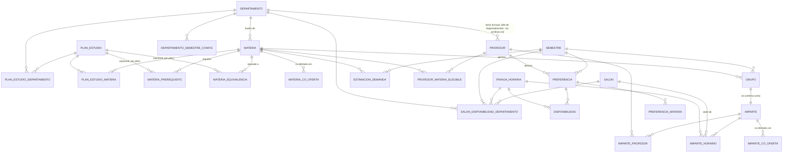
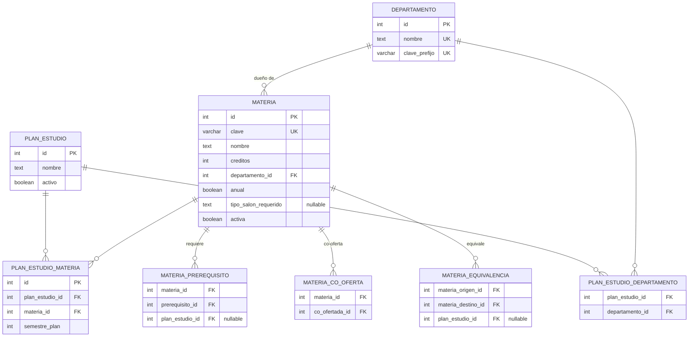
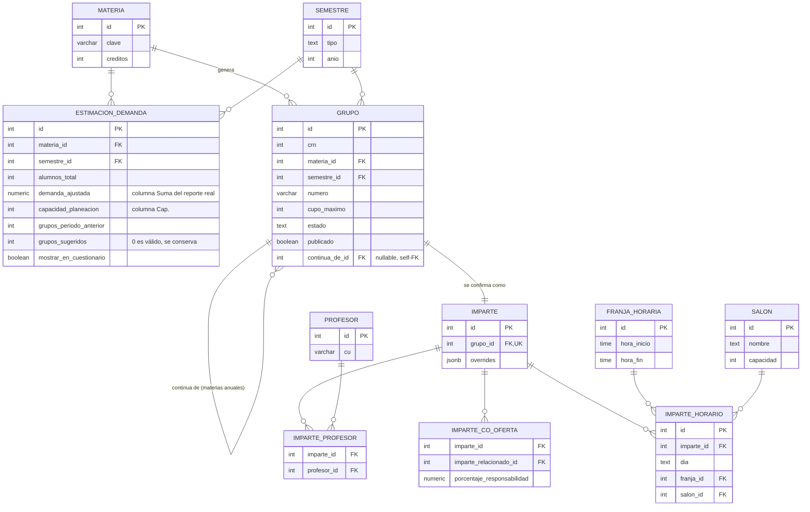
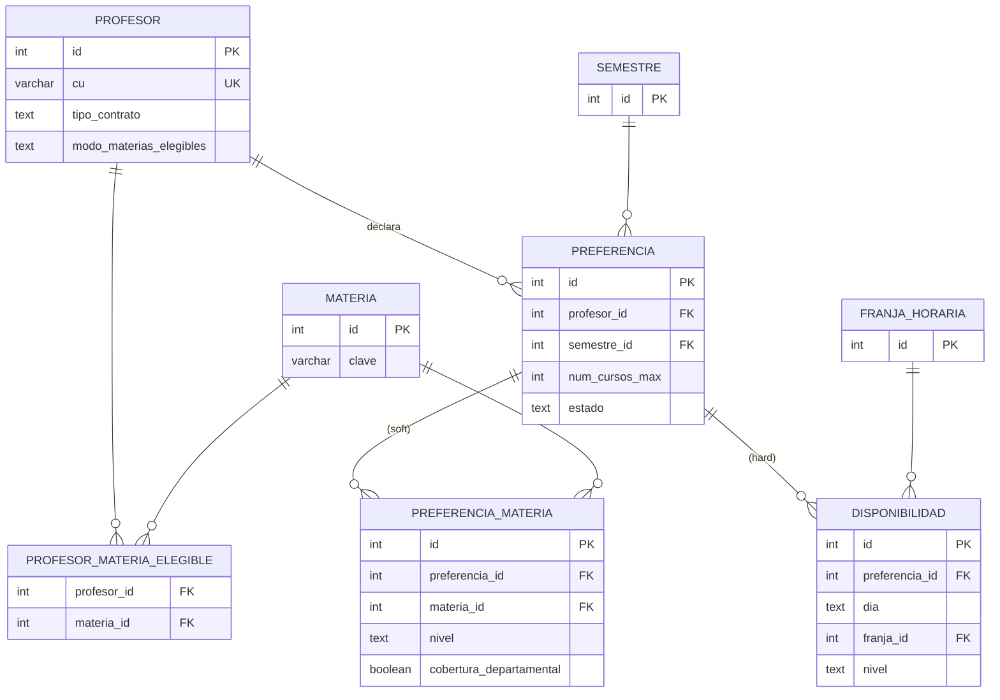
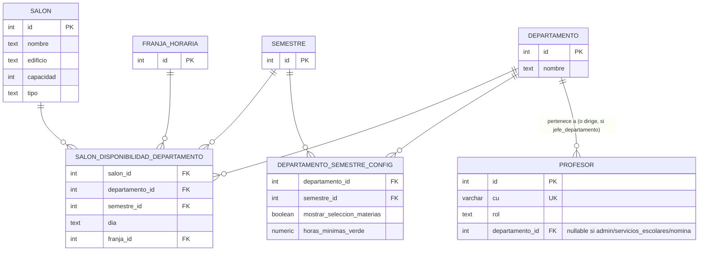

# Diagrama entidad-relación — Autoplanear

> Ver [`diseno-bd.md`](diseno-bd.md) para el detalle de columnas/constraints de cada tabla. Este
> diagrama es la versión visual, agrupada por dominio. Sustituye como diseño confirmado al borrador
> `../diagrama-modelo-datos-2026-08-21.drawio` (explícitamente marcado como borrador de trabajo, no
> definitivo, en `../BITACORA.md`). Para quien construya el motor de asignación: la copia pública de
> esta carpeta en `../malla-horarios/bd/` incluye `motor-asignacion.md`, un resumen de qué leer/
> escribir en cada tabla.

## Vista completa

## Dominio: catálogo académico

## Dominio: malla y asignación (Grupo → Imparte)

## Dominio: preferencias de profesores

## Dominio: salones, roles y configuración por departamento

Login unificado (2026-09-21): no existe una tabla `USUARIO` separada — `PROFESOR.rol` es la identidad
de cualquier rol (profesor, Jefe de Departamento, Servicios Escolares, Nómina, admin). Ver
`diseno-bd.md` §4.1/§4.3.

